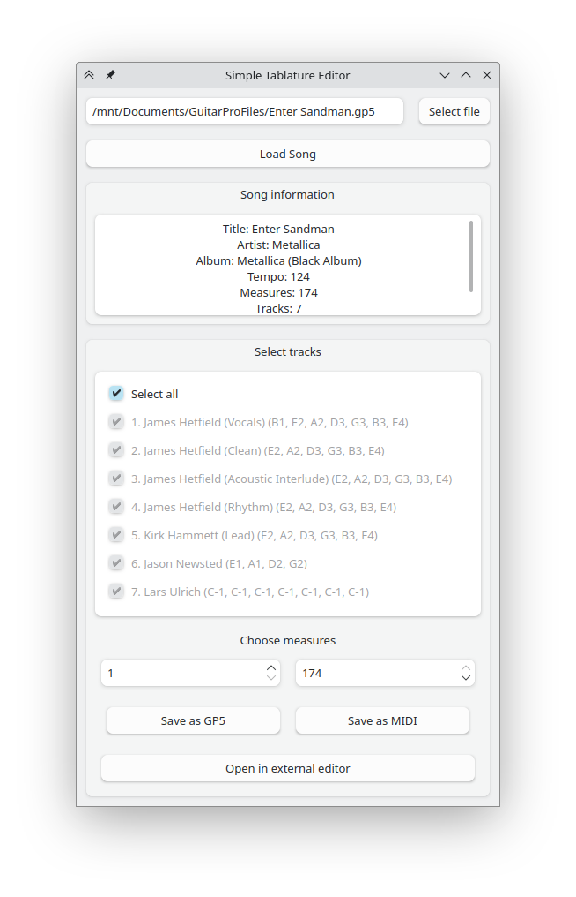

# Simple Tablature Editor
The Simple Tablature Editor is a lightweight tool designed to quickly edit GuitarPro files by cutting measures and removing existing tracks. Also, it offers the capability to convert edited files to MIDI format. 



There is also a CLI, with flags:

- `-i`, `--input`: Specify the path/url to the GuitarPro file (e.g., `-i path/to/file.gp`).
- `-t`, `--track`: Select specific tracks to include (e.g., `-t 1 2 3` to select tracks 1, 2, and 3).
- `-m`, `--measure`: Select specific measures to include (e.g., `-m 1 10` to select measures 1 to 10).
- `-o`, `--output`: Specify the name of the output file (e.g., `-o output.gp`).
- `--gp5`: Save the edited file as a GP5 file.
- `--midi`: Save the edited file as a MIDI file.
- `-e`, `--use-musescore`: Use Musescore to export MIDI files.
- `--musescore-path`: Specify the path to the Musescore executable file (default: `/usr/bin/mscore`).
- `--song-info`: Print information about the song.
- `--debug`: Print debug messages (works only with the `--midi` flag).

## Features

- **Fast Editing**: Easily cut measures and remove tracks from GuitarPro files, allowing you to refine your compositions efficiently.
- **MIDI Conversion**: Convert the edited files to MIDI format. You can use a built-in MIDI conversion tool or use MuseScore.
- **GUI and CLI**: Enjoy the flexibility of using either the Graphical User Interface or the Command-Line Interface.
- **Load Files**: Conveniently load GuitarPro files either from your local computer or via URLs
- **Open Edited Files**: Quickly open the edited file in a program that supports .gp5 files.


## Instalation
```sh
# git clone this repository
git clone https://github.com/4DERT/SimpleTablatureEditor
cd SimpleTablatureEditor

# build
python setup.py bdist_wheel

# install
cd dist
pip install ste-1.0-py3-none-any.whl

# run program
ste
```

## Acknowledgments
<a href="https://www.flaticon.com/free-icons/bass-guitar" title="bass guitar icons">Bass guitar icons created by Freepik - Flaticon</a>